# Module 7 Final Project: Show Us Your Data!

## Olist E-Commerce Database Analysis

**Name:** Ralph Massaquoi  
**Operating System:** Windows 11  
**Database:** PostgreSQL 18  
**Database Name:** `ecommerce_db`  
**Database Tool:** pgAdmin 4

## 1. Initial Data Source

For this project, I selected the **Brazilian E-Commerce Public Dataset by Olist**. 
The dataset contains information about e-commerce transactions in Brazil, including
customers, orders, products, order items, payments, sellers, and product categories.

I located and downloaded the dataset from Kaggle.

**Dataset:** Brazilian E-Commerce Public Dataset by Olist

**Source:** Kaggle

**Dataset Link:**  
https://www.kaggle.com/datasets/olistbr/brazilian-ecommerce

The dataset was downloaded as a ZIP file and extracted on my computer before
being imported into PostgreSQL.


## 2. Original Data Format

The Olist dataset was provided as multiple **CSV (Comma-Separated Values) files**.

The complete download contained nine CSV files. For this project, I selected five
related files and imported them into my PostgreSQL database.

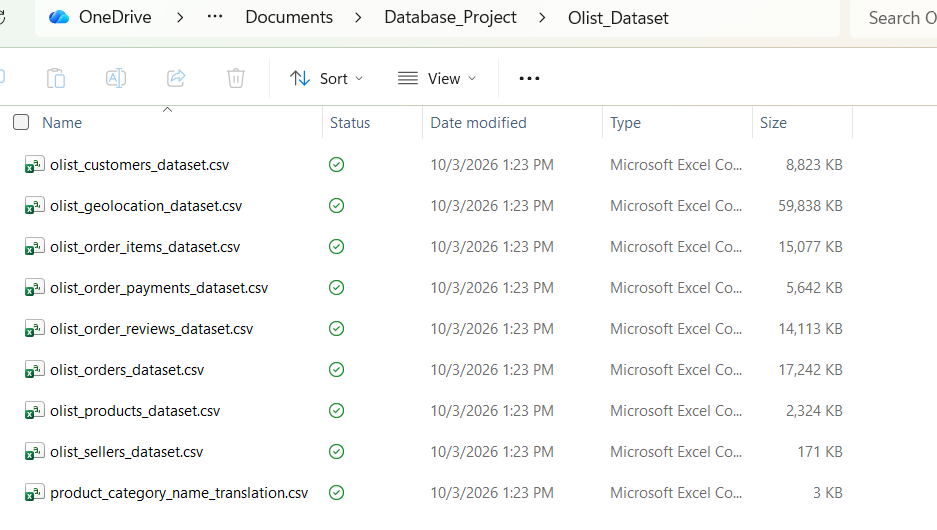

The selected data contains string, numeric, and date/time information and provides
relationships between customers, orders, products, order items, and payments.

## 3. Database Creation and Import Process

After downloading and extracting the Olist dataset, I used PostgreSQL 18
and pgAdmin 4 to create and populate my relational database.

I created a new PostgreSQL database named:

`ecommerce_db`

From the original nine CSV files, I selected five related datasets and
created the following PostgreSQL tables:

- `customers`
- `orders`
- `products`
- `order_items`
- `order_payments`

I created the tables using SQL `CREATE TABLE` statements. Appropriate
data types were assigned to the columns, including `VARCHAR`, `INTEGER`,
`NUMERIC`, and `TIMESTAMP`.

Primary keys and foreign keys were also used to establish relationships
between the tables.

The CSV files were then imported using the pgAdmin Import/Export Data
tool. The import settings included:

- Format: CSV
- Encoding: UTF8
- Header: Yes
- Delimiter: Comma (,)
- Quote: Double quote (")

The tables were loaded in an order that respected their relationships.
For example, the `customers` table was loaded before the `orders` table
because `orders.customer_id` references `customers.customer_id`.

After importing each dataset, I used SQL queries to verify that the data
had been successfully loaded.

The screenshot below shows the five tables created in the `ecommerce_db`
database using PostgreSQL 18 and pgAdmin 4.

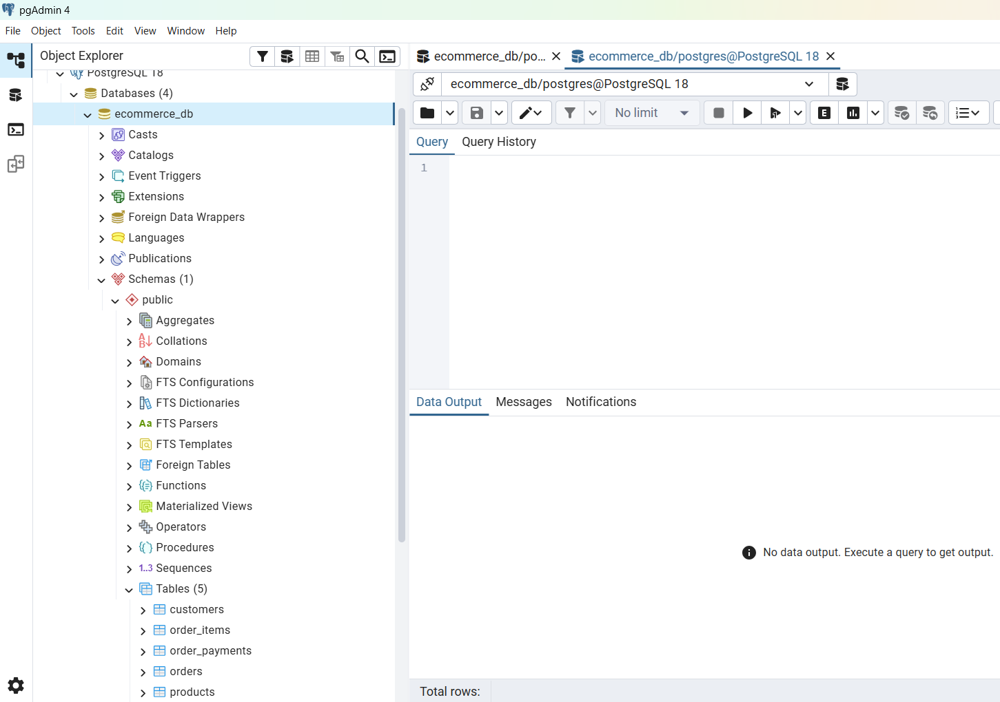

## 4. Database Structure and Data Types

The five PostgreSQL tables were created with data types appropriate for
the information stored in each column. The database includes string,
numeric, and date/time data types.

The database also uses primary keys and foreign keys to establish
relationships between the tables.

The results confirm that the database contains multiple data types,
including character varying (string), integer and numeric values,
and timestamp (date/time) values. This satisfies the required string,
numeric, and date/time data types for the project.

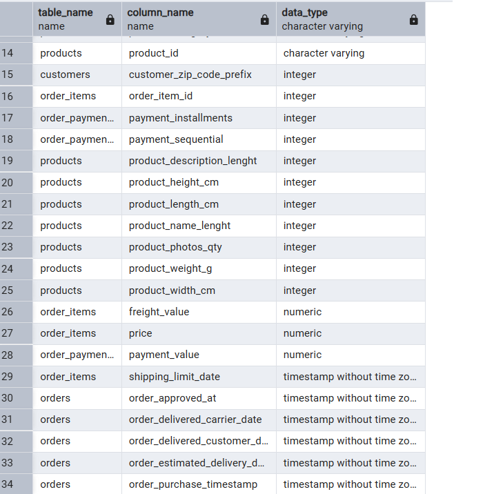

## 5. Data Dictionary

I created a data dictionary to describe the attributes used in the five
PostgreSQL tables. The dictionary identifies the table name, column name,
data type, and a description of each attribute.

The database contains 34 columns across the five selected tables.

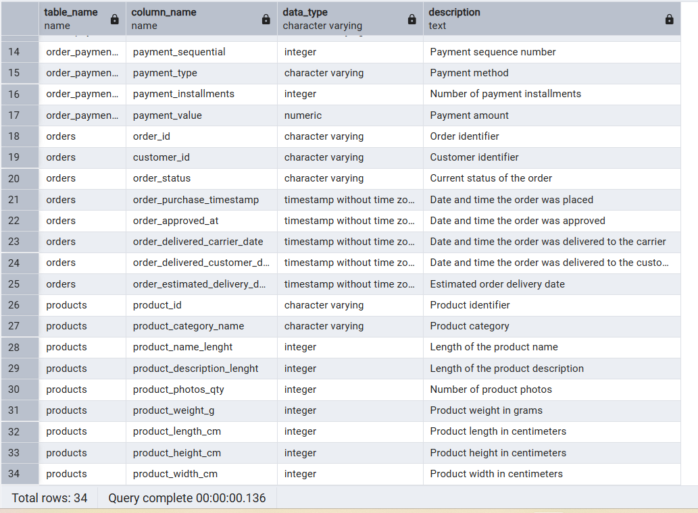

## 6. Row Count Verification

After importing the data, I used the following SQL query to verify the
number of records in each table.

### SQL

SELECT 'customers' AS table_name, COUNT(*) AS total_rows
FROM customers

UNION ALL

SELECT 'orders', COUNT(*)
FROM orders

UNION ALL

SELECT 'products', COUNT(*)
FROM products

UNION ALL

SELECT 'order_items', COUNT(*)
FROM order_items

UNION ALL

SELECT 'order_payments', COUNT(*)
FROM order_payments;

### Results

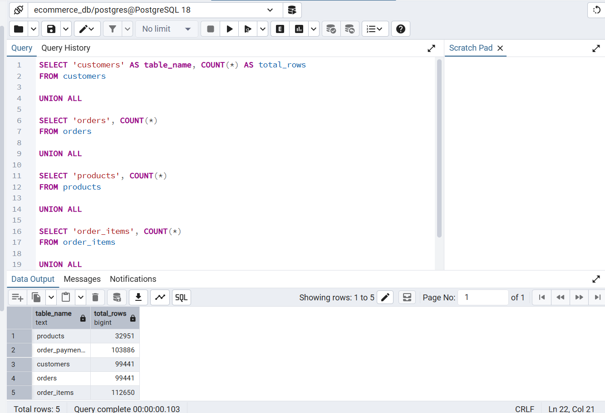


## 7. Select Data From Each Table

After verifying the record counts, I queried each table to inspect the
imported data and confirm that the columns and values were loaded correctly.

### Customers

```sql
SELECT * FROM customers;
```

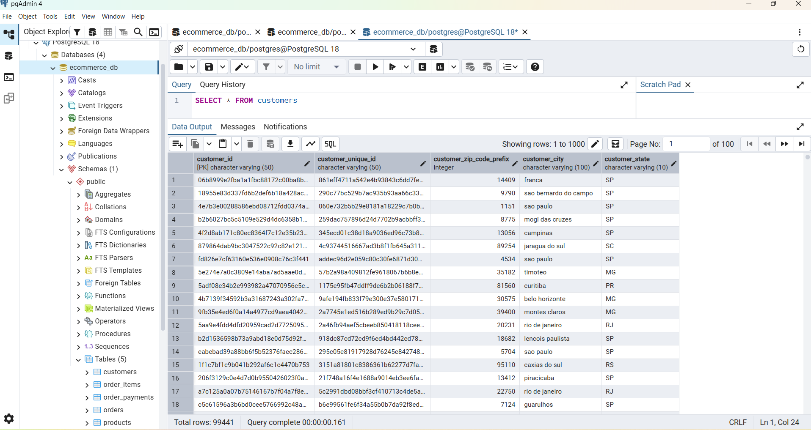

### Orders

```sql
SELECT * FROM orders;
```

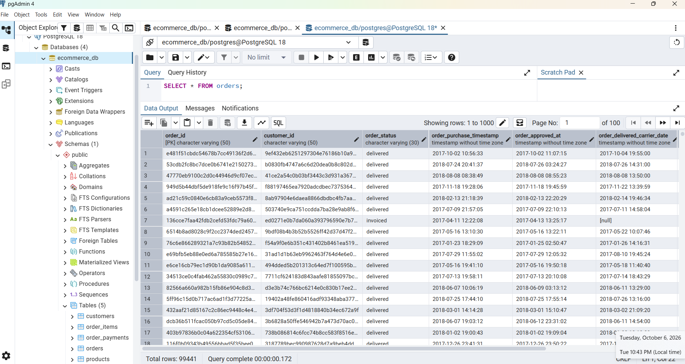

### Products

```sql
SELECT * FROM products;
```

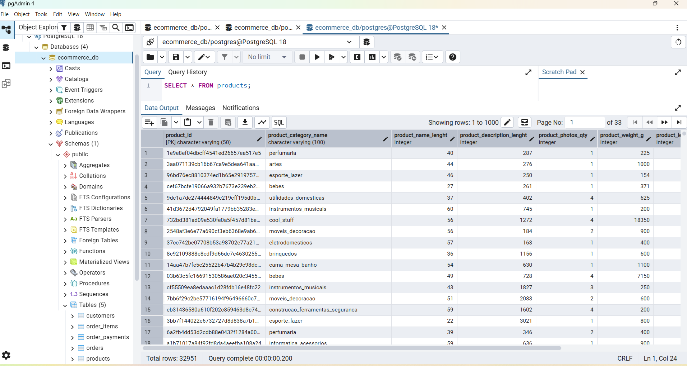

### Order Items

```sql
SELECT * FROM order_items;
```

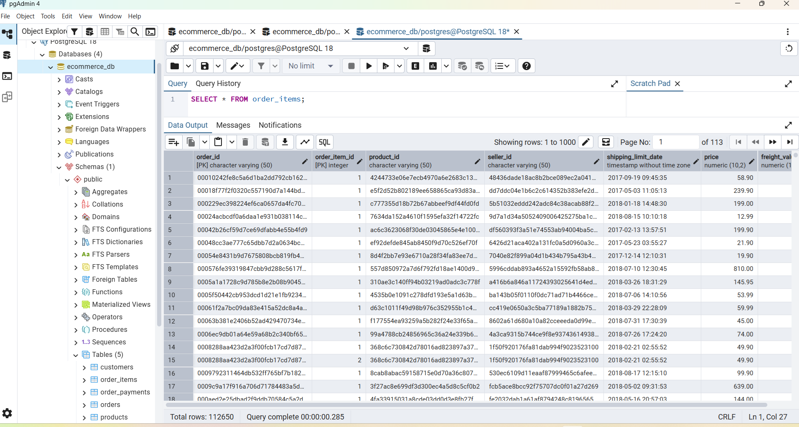

### Order Payments

```sql
SELECT * FROM order_payments;
```

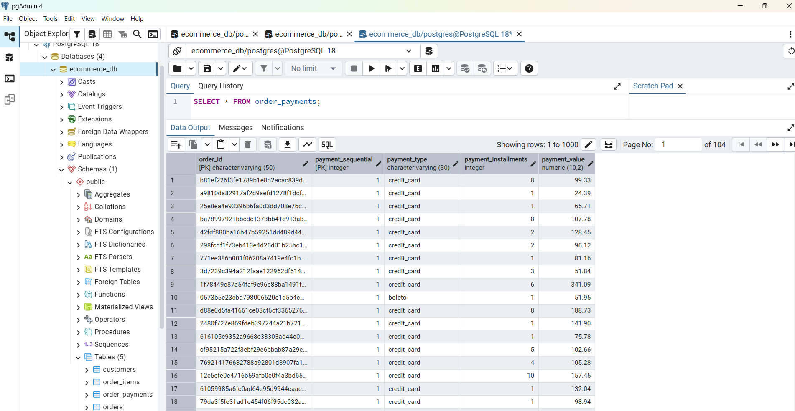

## 8. Interesting Queries and Data Verification

After importing and verifying the individual tables, I used SQL queries
to combine and analyze the data. These queries helped verify the
relationships between the tables and provided information that was not
available by examining a single table.

### 8.1 Customers and Orders — JOIN Query

This query joins the `customers` and `orders` tables using `customer_id`.
It shows the customer's city and state along with the order ID, order
status, and purchase date.

```sql
SELECT
    c.customer_city,
    c.customer_state,
    o.order_id,
    o.order_status,
    o.order_purchase_timestamp
FROM customers AS c
JOIN orders AS o
    ON c.customer_id = o.customer_id
LIMIT 20;
```

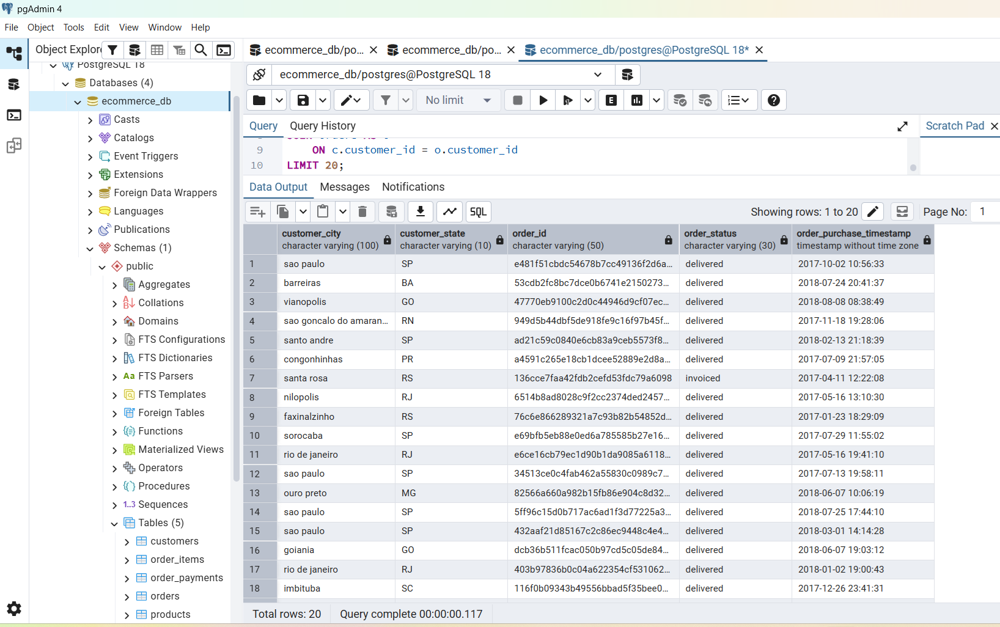


### 8.2 Sales by State — GROUP BY and Aggregate Query

I used the following query to determine the number of orders and total
product sales for each customer state. The query joins the `customers`,
`orders`, and `order_items` tables and uses aggregate functions to
summarize the data.

```sql
SELECT
    c.customer_state,
    COUNT(DISTINCT o.order_id) AS total_orders,
    ROUND(SUM(oi.price), 2) AS total_sales
FROM customers AS c
JOIN orders AS o
    ON c.customer_id = o.customer_id
JOIN order_items AS oi
    ON o.order_id = oi.order_id
GROUP BY c.customer_state
ORDER BY total_sales DESC;
```

### Results

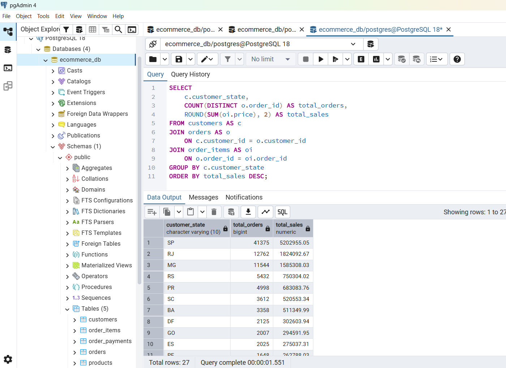

The results show that São Paulo (`SP`) had the highest number of orders
and the highest total product sales in the dataset. São Paulo had
41,375 orders and approximately 5,202,955.05 in total product sales.
Rio de Janeiro (`RJ`) and Minas Gerais (`MG`) followed with the next
highest total sales.

This analysis demonstrates how multiple related tables can be joined
and aggregated to identify geographic sales patterns.
