# Module 7 Final Project: Show Us Your Data!

## 2015 Flight Delays and Cancellations Database Analysis

**Name:** Ralph Massaquoi

**Operating System:** Windows 11

**Database:** PostgreSQL 18

**Database Name:** 'flight_delays_db`

**Database Tool:** pgAdmin 4


## 1. Project Overview

For my final project, I created a PostgreSQL database to analyze U.S. airline flight delays and cancellations from 2015. The dataset contains information
about airlines, airports, flight schedules, departure and arrival delays, cancellations, delay causes, and airport geographic locations. I used PostgreSQL 18 and pgAdmin 4 to create, import, transform, verify, and query the data. The database was named `flight_delays_db`.

The purpose of this project is to demonstrate how a large raw dataset can be transformed into a relational database and then queried to discover useful
information about airline operations, delays, cancellations, airports, and flight routes.


## 2. Initial Data Source

The project uses the **2015 Flight Delays and Cancellations** dataset.
**Dataset Link:**
https://www.kaggle.com/datasets/usdot/flight-delays?select=airlines.csv

The original data was provided in CSV format and consisted of three main files:

- `airlines.csv` – airline codes and airline names
- `airports.csv` – airport information including airport codes, names, cities, states, latitude, and longitude
- `flights.csv` – detailed flight records including airline, origin, destination, scheduled times, actual times, delays, cancellations, distance, and delay causes

The flight data originates from U.S. air transportation records and provides a sufficiently large and complex dataset for relational database analysis.
The screenshot below shows the original dataset files after they were downloadeda nd extracted.

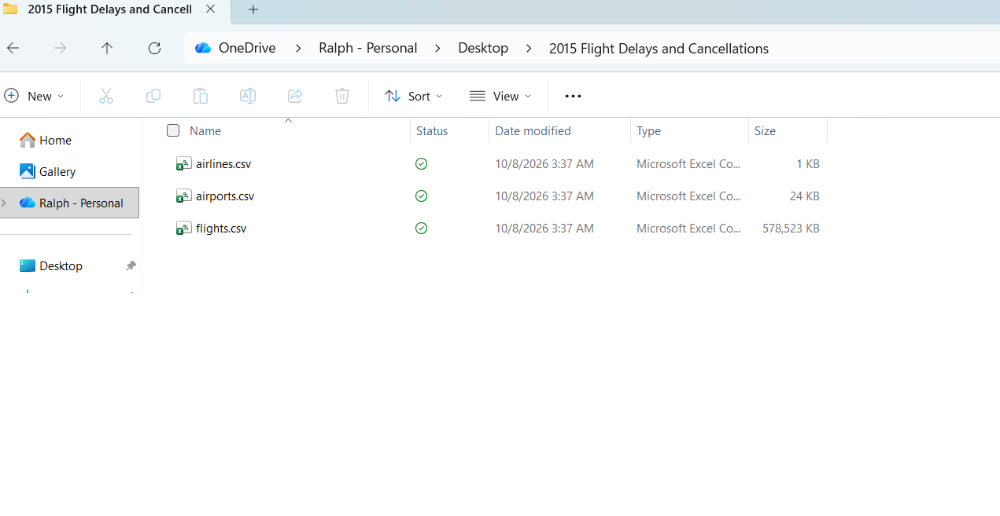


## 3. Dataset Format, Columns, and Rows

The original datasets were provided in CSV format and imported into PostgreSQL.
The following query verifies the number of records and columns in each database
table.

**Note:** The original dataset contained three CSV files. The `routes` table
was created later in PostgreSQL during the data transformation process and
contains 4,693 unique origin-to-destination routes.

```sql
SELECT
    t.table_name,
    t.number_of_records,
    c.number_of_columns
FROM (
    SELECT 'airlines' AS table_name, COUNT(*) AS number_of_records
    FROM airlines

    UNION ALL

    SELECT 'airports', COUNT(*)
    FROM airports

    UNION ALL

    SELECT 'flights', COUNT(*)
    FROM flights

    UNION ALL

    SELECT 'routes', COUNT(*)
    FROM routes
) AS t
JOIN (
    SELECT
        table_name,
        COUNT(*) AS number_of_columns
    FROM information_schema.columns
    WHERE table_schema = 'public'
      AND table_name IN ('airlines', 'airports', 'flights', 'routes')
    GROUP BY table_name
) AS c
    ON t.table_name = c.table_name
ORDER BY
    CASE t.table_name
        WHEN 'airlines' THEN 1
        WHEN 'airports' THEN 2
        WHEN 'flights' THEN 3
        WHEN 'routes' THEN 4
    END;
```

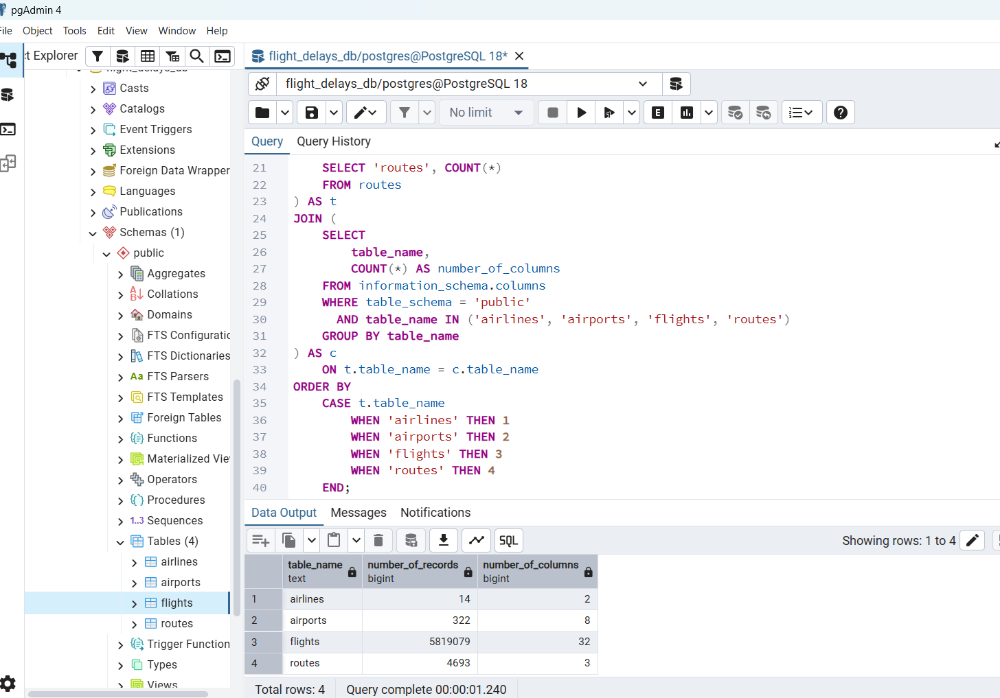
The `flights` table is the largest table, containing more than 5.8 million records. This demonstrates the size and complexity of the dataset used in
this project.


## 4. Data Dictionary

The following data dictionary shows the attributes and data types for each table in the PostgreSQL database. The information was retrieved directly from PostgreSQL using the `information_schema.columns` view.

### 4.1 Airlines Table

```sql
SELECT
    column_name AS attribute,
    data_type
FROM information_schema.columns
WHERE table_schema = 'public'
  AND table_name = 'airlines'
ORDER BY ordinal_position;
```

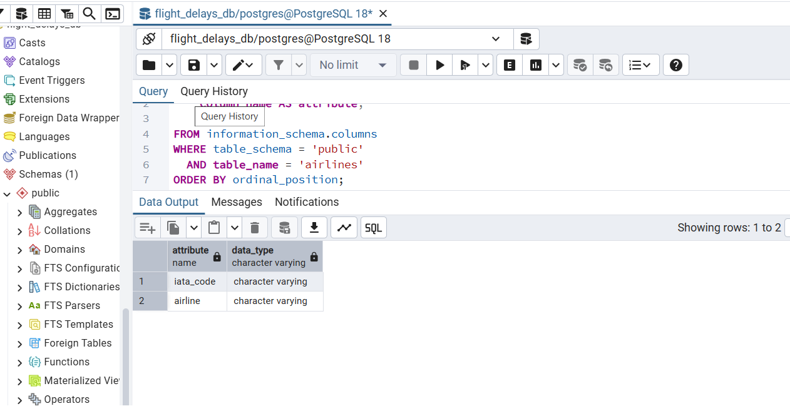

### 4.2 Airports Table

```sql
SELECT
    column_name AS attribute,
    data_type
FROM information_schema.columns
WHERE table_schema = 'public'
  AND table_name = 'airports'
ORDER BY ordinal_position;
```

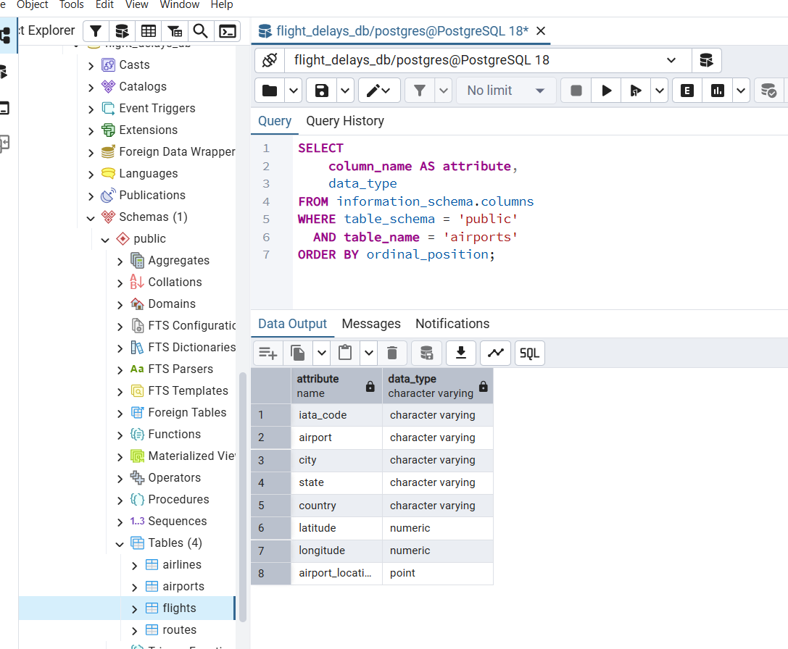

### 4.3 Flights Table

```sql
SELECT
    ordinal_position AS column_number,
    column_name AS attribute,
    data_type
FROM information_schema.columns
WHERE table_schema = 'public'
  AND table_name = 'flights'
ORDER BY ordinal_position;
```

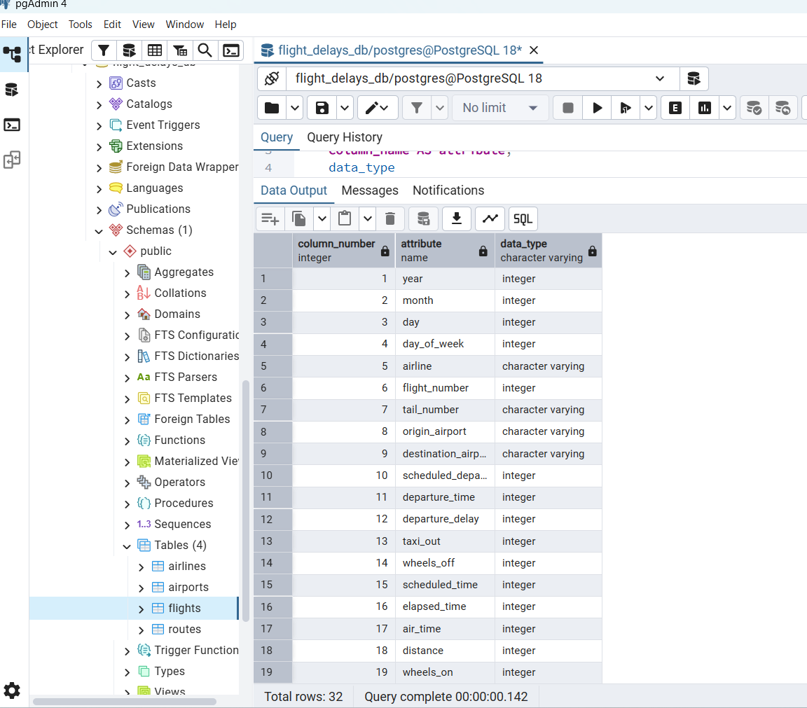

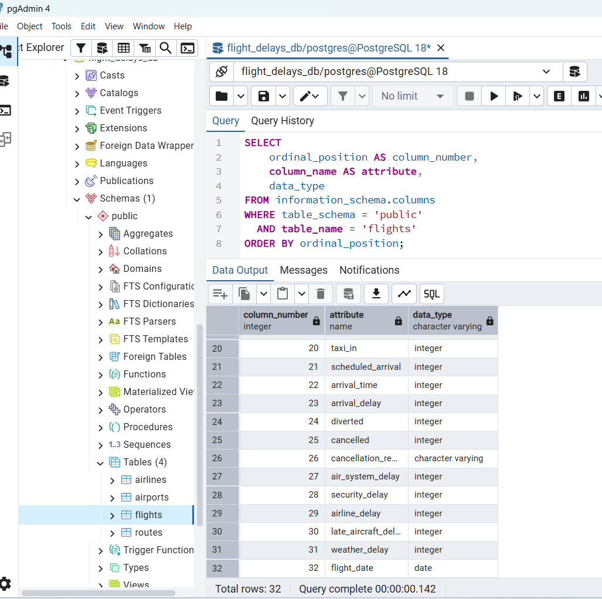

### 4.4 Routes Table

```sql
SELECT
    ordinal_position AS column_number,
    column_name AS attribute,
    data_type
FROM information_schema.columns
WHERE table_schema = 'public'
  AND table_name = 'routes'
ORDER BY ordinal_position;
```

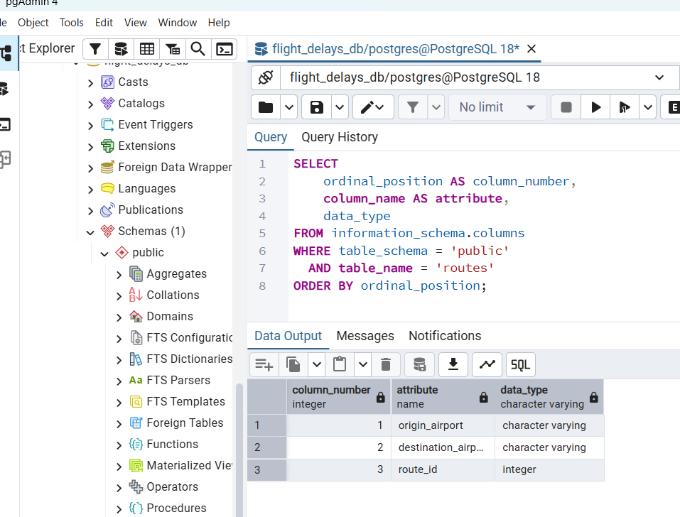

## 5. Data Transformation

After importing the original CSV files into PostgreSQL, I performed several transformations to make the data easier to query and analyze. These included
creating a complete flight date, creating a routes table, preparing airport geographic locations, and identifying missing geographic data.

### 5.1 Creating and Verifying the Flight Date

The original `flights` dataset stored the year, month, and day in separate columns. I combined these values into a PostgreSQL `DATE` column named `flight_date`. This made it easier to perform monthly and date-based analysis.

The following query was used to verify the resulting flight dates:

```sql
SELECT
    year,
    month,
    day,
    flight_date
FROM flights
LIMIT 20;
```

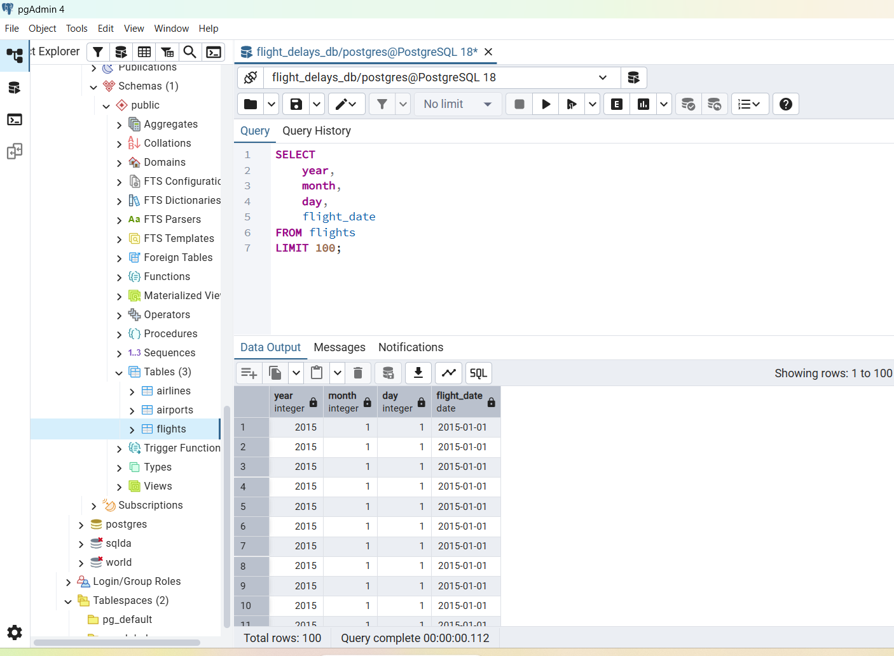

### 5.2 Creating and Verifying the Routes Table

The original dataset contained three CSV files: `airlines.csv`, `airports.csv`, and `flights.csv`. During the transformation process, I created an additional `routes` table to support route and geographic analysis.

While examining the flight data, I found that the origin and destination airport fields contained both three-letter IATA airport codes and numeric airport identifiers. For the route analysis, I used records containing three-letter IATA airport codes.

The following query identifies the unique IATA origin-to-destination route combinations from the `flights` table:

```sql
SELECT DISTINCT
    origin_airport,
    destination_airport
FROM flights
WHERE origin_airport ~ '^[A-Z]{3}$'
  AND destination_airport ~ '^[A-Z]{3}$';
```

The query returned **4,693 unique origin-to-destination routes**. These route combinations were used for the `routes` table.

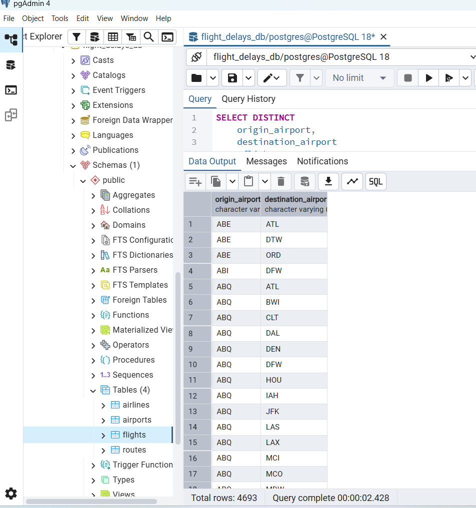

### 5.3 Creating Airport Geographic Locations

The `airports` table contains latitude and longitude values for airport locations. To prepare the geographic data for route analysis, I created
an `airport_location` value using PostgreSQL's `point` data type.

The longitude and latitude values were combined using the following SQL:

```sql
UPDATE airports
SET airport_location = point(longitude, latitude);
```

PostgreSQL processed all **322 airport records** during the update.

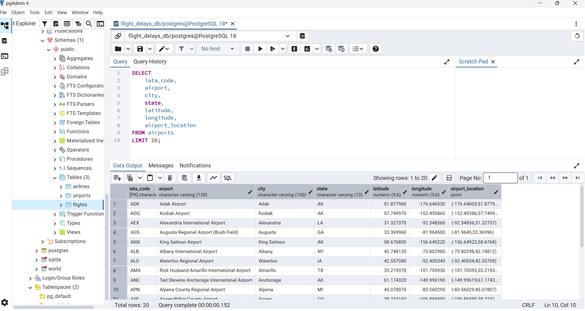

### 5.4 Identifying Missing Airport Locations

After creating the `airport_location` values, I checked the airport data for missing latitude and longitude coordinates. Missing coordinates would
produce NULL location values and could not be used reliably in geographic distance calculations.

The following query identifies airports with missing coordinate data:

```sql
SELECT
    iata_code,
    airport,
    city,
    state,
    latitude,
    longitude,
    airport_location
FROM airports
WHERE latitude IS NULL
   OR longitude IS NULL;
```

The query identified **three airports** with missing geographic coordinates. Instead of assigning artificial coordinates, I excluded these airports from
analyses that required valid geographic locations.

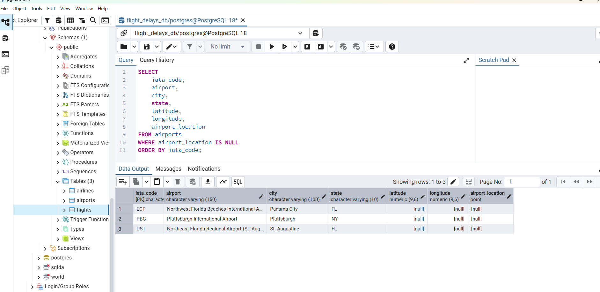

## 6. Table Structure and Data Types

The final PostgreSQL database contains four tables: `airlines`, `airports`, `flights`, and `routes`. The detailed attributes and data types for each
table are provided in the Data Dictionary in Section 4.

The following query summarizes the number of columns and the PostgreSQL data types used in each table.

```sql
SELECT
    table_name,
    COUNT(*) AS total_columns,
    STRING_AGG(DISTINCT data_type, ', ' ORDER BY data_type) AS data_types
FROM information_schema.columns
WHERE table_schema = 'public'
  AND table_name IN ('airlines', 'airports', 'flights', 'routes')
GROUP BY table_name
ORDER BY
    CASE table_name
        WHEN 'airlines' THEN 1
        WHEN 'airports' THEN 2
        WHEN 'flights' THEN 3
        WHEN 'routes' THEN 4
    END;
```

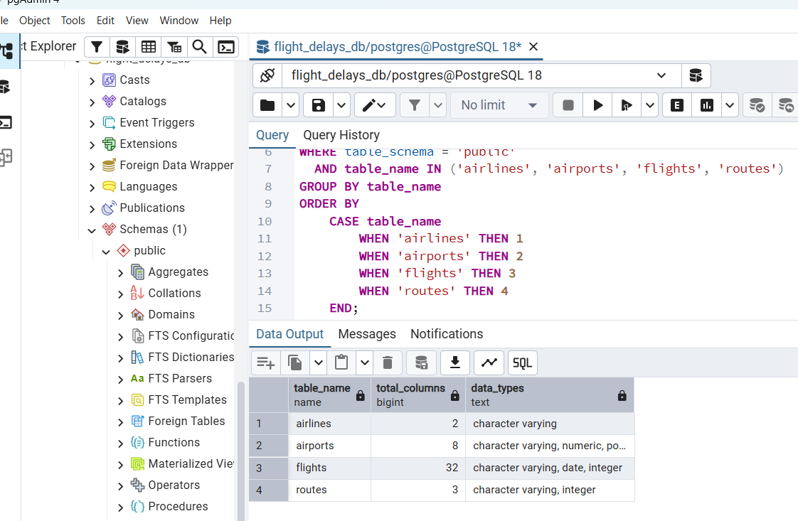

The database uses multiple data types, including `character varying`, `integer`, `numeric`, `date`, and `point`. This supports textual,
numerical, date-based, and geographic analysis.

## 7. SELECT * From Each Table

The following queries were used to display and verify records from each table in the database. A `LIMIT` was used on the larger tables so the
results could be displayed clearly.

### 7.1 Airlines Table

```sql
SELECT *
FROM airlines;
```

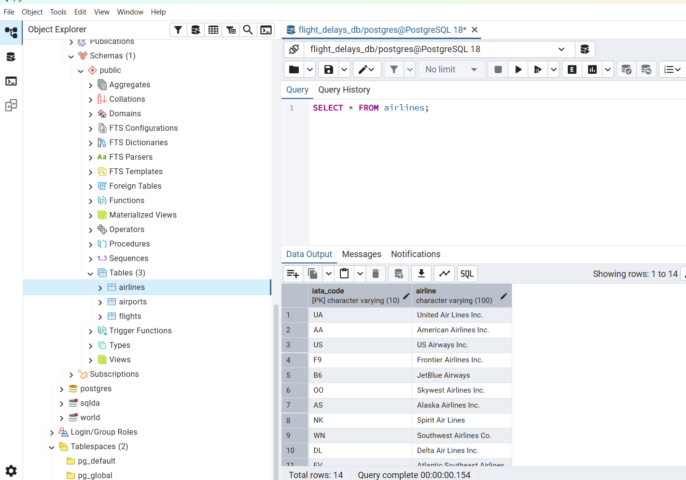

### 7.2 Airports Table

```sql
SELECT *
FROM airports
LIMIT 20;
```

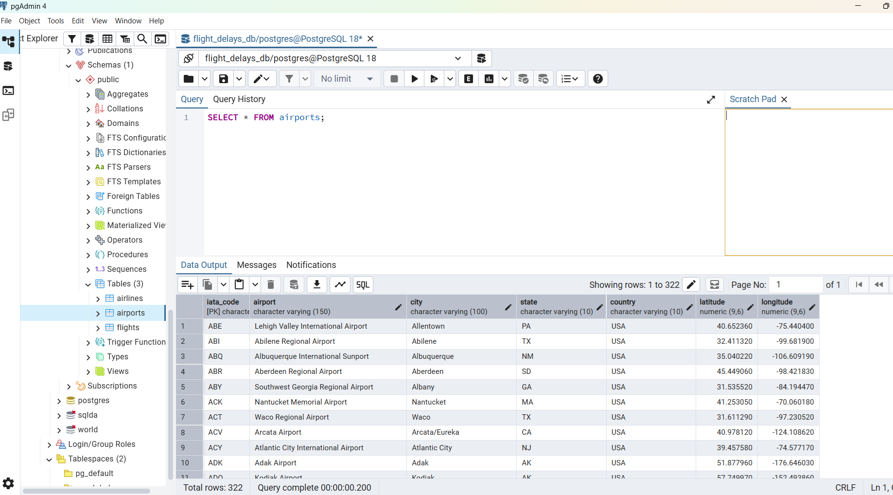

### 7.3 Flights Table

```sql
SELECT *
FROM flights
LIMIT 20;
```

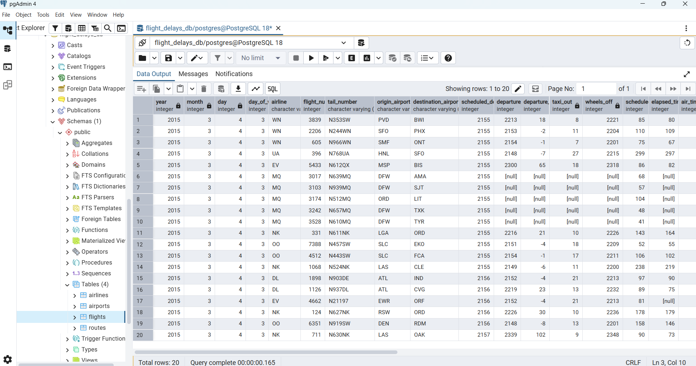

### 7.4 Routes Table

```sql
SELECT *
FROM routes
ORDER BY route_id
LIMIT 20;
```

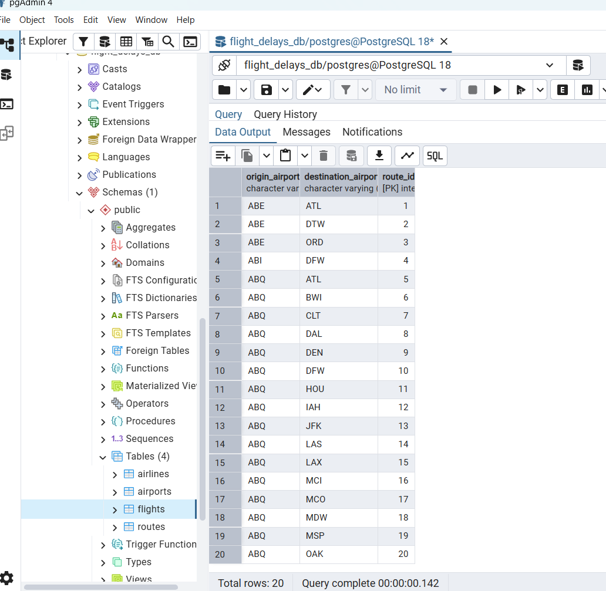

## 8. Interesting Queries and Analysis

After preparing and verifying the database, I used SQL queries to explore the flight data and identify useful patterns. The analyses include joins,
aggregations, flight delays, airport activity, cancellations, and geographic route analysis.

### 8.1 JOIN Query – Routes and Airport Information

The following query joins the `routes` table to the `airports` table twice. The first join retrieves information about the origin airport, while the
second retrieves information about the destination airport.

```sql
SELECT
    r.route_id,
    r.origin_airport,
    a1.airport AS origin_airport_name,
    a1.city AS origin_city,
    a1.state AS origin_state,
    r.destination_airport,
    a2.airport AS destination_airport_name,
    a2.city AS destination_city,
    a2.state AS destination_state
FROM routes AS r
JOIN airports AS a1
    ON r.origin_airport = a1.iata_code
JOIN airports AS a2
    ON r.destination_airport = a2.iata_code
ORDER BY r.route_id
LIMIT 20;
```

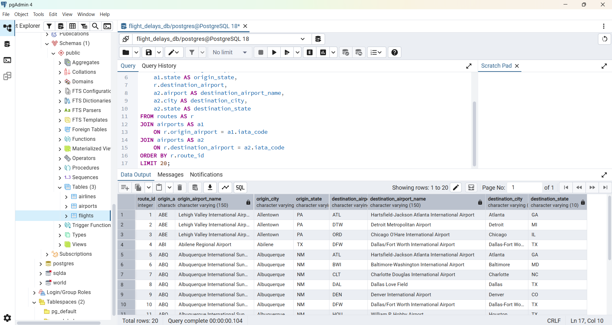

This query demonstrates how related tables can be joined using airport IATA codes. It adds airport names, cities, and states to the origin and destination
codes stored in the `routes` table.

### 8.2 GROUP BY and Aggregate Query – Average Delays by Airline

To compare airline performance, I grouped the flight records by airline and calculated the total number of flights and the average departure and arrival delays.

Cancelled flights and records without an arrival delay were excluded from the calculation.

```sql
SELECT
    f.airline AS airline_code,
    a.airline AS airline_name,
    COUNT(*) AS total_flights,
    ROUND(AVG(f.departure_delay)::numeric, 2) AS avg_departure_delay,
    ROUND(AVG(f.arrival_delay)::numeric, 2) AS avg_arrival_delay
FROM flights AS f
JOIN airlines AS a
    ON f.airline = a.iata_code
WHERE f.cancelled = 0
    AND f.arrival_delay IS NOT NULL
GROUP BY
    f.airline,
    a.airline
ORDER BY avg_arrival_delay DESC;
```

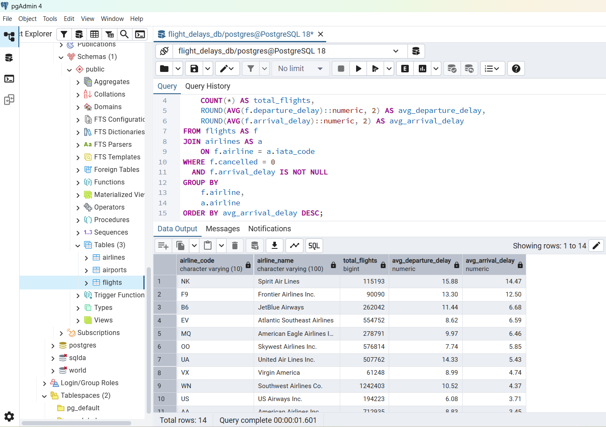

The results show differences in delay performance among airlines. Spirit Airlines had the highest average arrival delay in this analysis at approximately **14.47 minutes**, followed by Frontier Airlines at approximately **12.50 minutes**.


### 8.3 Busiest Airports by Number of Departures

To identify the busiest airports in the dataset, I counted the number of departing flights from each origin airport and joined the results with the
`airports` table to display the airport name, city, and state.

```sql
SELECT
    f.origin_airport AS airport_code,
    a.airport AS airport_name,
    a.city,
    a.state,
    COUNT(*) AS total_departures
FROM flights AS f
JOIN airports AS a
    ON f.origin_airport = a.iata_code
GROUP BY
    f.origin_airport,
    a.airport,
    a.city,
    a.state
ORDER BY total_departures DESC
LIMIT 10;
```

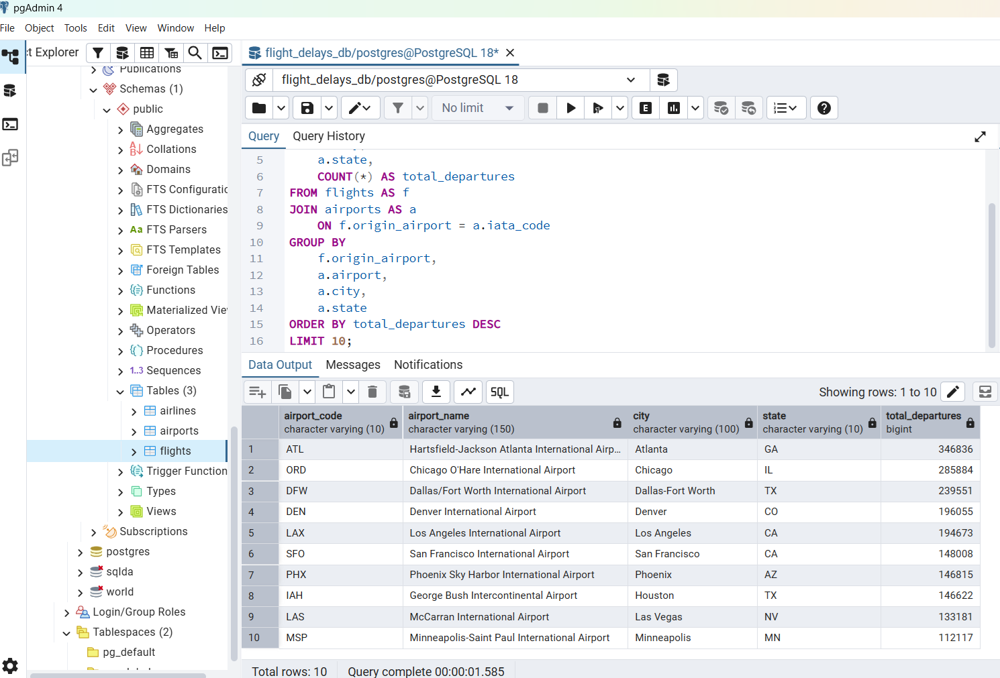

The results show that **Hartsfield-Jackson Atlanta International Airport (ATL)** had the highest number of departures in the dataset with
**346,836 flights**.

Other major airports appearing among the busiest included Chicago O'Hare (ORD), Dallas/Fort Worth (DFW), Denver (DEN), and Los Angeles (LAX).

### 8.4 Monthly Flight Delay Trends

To examine how flight delays changed throughout the year, I grouped the flight records by month and calculated the average departure and arrival
delays. Cancelled flights and records without arrival delay information were excluded.

```sql
SELECT
    EXTRACT(MONTH FROM flight_date) AS month,
    COUNT(*) AS total_flights,
    ROUND(AVG(departure_delay)::numeric, 2) AS avg_departure_delay,
    ROUND(AVG(arrival_delay)::numeric, 2) AS avg_arrival_delay
FROM flights
WHERE cancelled = 0
  AND flight_date IS NOT NULL
  AND arrival_delay IS NOT NULL
GROUP BY EXTRACT(MONTH FROM flight_date)
ORDER BY month;
```

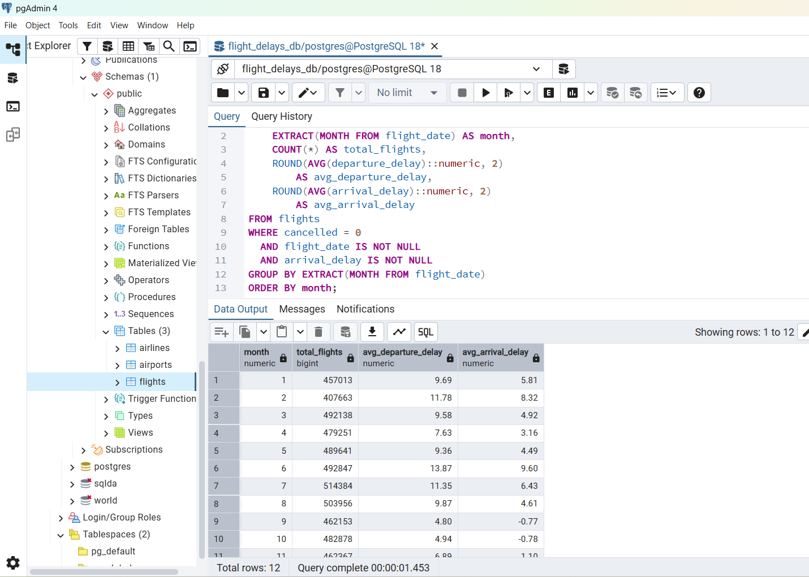

The results show that flight delays varied throughout the year. **June** had one of the highest average delay levels, with an average departure
delay of approximately **13.87 minutes** and an average arrival delay of approximately **9.60 minutes**.

In contrast, September and October had average arrival delays slightly below zero, indicating that flights during those months arrived slightly
earlier than their scheduled arrival times on average.

### 8.5 Average Delay by Cause

The flight dataset contains several categories that explain the causes of flight delays. I compared the average number of delay minutes associated
with air system, security, airline, late aircraft, and weather delays.

```sql
SELECT
    delay_cause,
    ROUND(AVG(delay_minutes)::numeric, 2) AS avg_delay_minutes
FROM (
    SELECT 'Air System' AS delay_cause,
           air_system_delay AS delay_minutes
    FROM flights
    WHERE cancelled = 0

    UNION ALL

    SELECT 'Security',
           security_delay
    FROM flights
    WHERE cancelled = 0

    UNION ALL

    SELECT 'Airline',
           airline_delay
    FROM flights
    WHERE cancelled = 0

    UNION ALL

    SELECT 'Late Aircraft',
           late_aircraft_delay
    FROM flights
    WHERE cancelled = 0

    UNION ALL

    SELECT 'Weather',
           weather_delay
    FROM flights
    WHERE cancelled = 0
) AS delay_data
WHERE delay_minutes IS NOT NULL
GROUP BY delay_cause
ORDER BY avg_delay_minutes DESC;
```

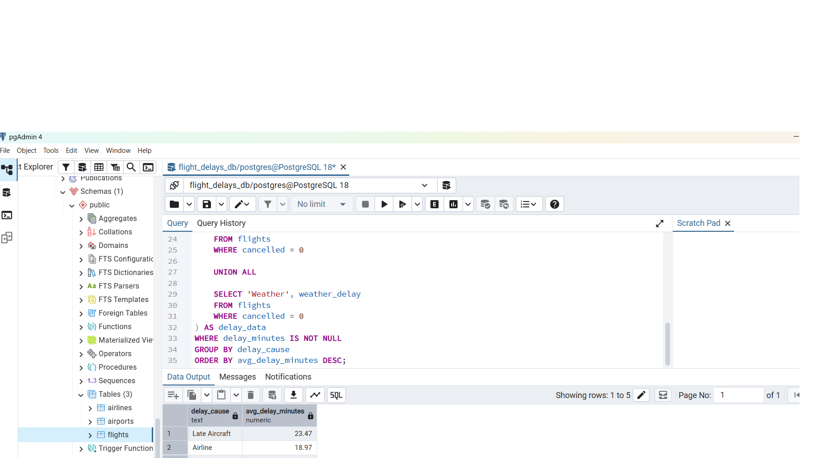

The results show that **late aircraft delays had the highest average recorded delay at approximately 23.47 minutes**. Airline delays averaged approximately **18.97 minutes**, followed by air system delays at approximately **13.48 minutes**.

Weather delays averaged approximately **2.92 minutes**, while security delays had the lowest average at approximately **0.08 minutes**.

This analysis helps identify which recorded delay categories were associated with the largest average delay times in the dataset.

### 8.6 Airline Cancellation Rates

To compare airline cancellation performance, I calculated the number of cancelled flights and the cancellation rate for each airline.

```sql
SELECT
    f.airline AS airline_code,
    a.airline AS airline_name,
    COUNT(*) AS total_flights,
    SUM(f.cancelled) AS cancelled_flights,
    ROUND(
        100.0 * SUM(f.cancelled) / COUNT(*),
        2
    ) AS cancellation_rate_percent
FROM flights AS f
JOIN airlines AS a
    ON f.airline = a.iata_code
GROUP BY
    f.airline,
    a.airline
ORDER BY cancellation_rate_percent DESC;
```

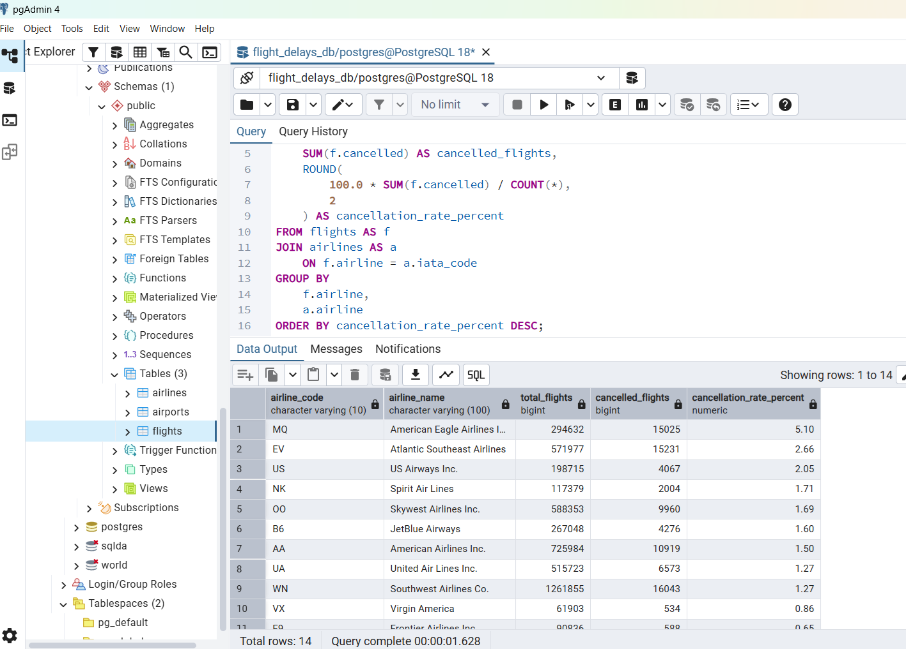

The results show that **American Eagle Airlines (MQ)** had the highest cancellation rate in the dataset at approximately **5.10%**, with **15,025 cancelled flights out of 294,632 total flights**.

Atlantic Southeast Airlines (EV) had the next highest cancellation rate at approximately **2.66%**. This analysis demonstrates how aggregate functions can be used to compare operational performance among airlines.
